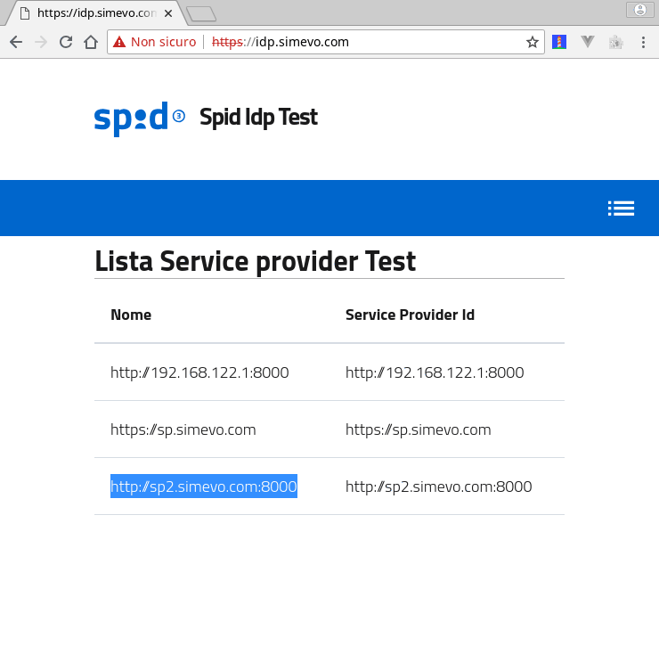

[](https://developersitalia.slack.com/messages/C7ESTMQDQ)
[](https://slack.developers.italia.it/)
[](https://forum.italia.it/c/spid)

> ⚠️ **WORK IN PROGRESS (but should be useable)** ⚠️

# spid-php2
PHP package for SPID authentication based on [php-saml](https://github.com/onelogin/php-saml).

This PHP package is aimed at implementing SPID **Service Providers**. [SPID](https://www.spid.gov.it/) is the Italian digital identity system, which enables citizens to access all public services with a single set of credentials. This package provides a layer of abstraction over the SAML protocol by exposing just the subset required in order to implement SPID authentication in a web application.

Features:
- **routing-agnostic**, can be integrated in any web framework / CMS
- **sessionless** (apart from a short-lived internal session used to store the request ID and IdP name until the IdP responds)
- does not currently support Attribute Authority (AA).

Alternatives for PHP:
- [spid-php](https://github.com/italia/spid-php) based on [SimpleSAMLphp](https://simplesamlphp.org/)
- [spid-php3](https://github.com/simevo/spid-php3), a lean implementation that does not rely on external SAML packages

Alternatives for other languages:
- [spid-perl](https://github.com/italia/spid-perl)
- [spid-ruby](https://github.com/italia/spid-ruby)

## Compliance

|<br />_Compliance with [SPID regulations](http://www.agid.gov.it/sites/default/files/circolari/spid-regole_tecniche_v1.pdf) (for Service Providers)_|status (! = TODO)|comments|
|:---|:---|:---|
|**Metadata:**|||
|parsing of IdP XML metadata (1.2.2.4)|!|the implementation is not currently checking the AgID signature, see: [#17](https://github.com/simevo/spid-php2/issues/17)|
|parsing of AA XML metadata (2.2.4)||Attribute Authority is unsupported|
|SP XML metadata generation (1.3.2)|!|the SP metadata is made available at the `/metadata.php` endpoint; it is currently lacking the `AttributeConsumingService` ([#18](https://github.com/simevo/spid-php2/issues/18)) and the optional `Organization` key ([#19](https://github.com/simevo/spid-php2/issues/19))|
|**AuthnRequest generation (1.2.2.1):**|||
|generation of AuthnRequest XML|✓||
|HTTP-Redirect binding|✓||
|HTTP-POST binding|||
|`AssertionConsumerServiceURL` customization|!|the underlying PHP package we are using as a basis for this SDK ([onelogin/php-saml](https://github.com/onelogin/php-saml)) allows customization of the AuthnRequest, but we are not exposing yet this interface; this is tracked in: [#21](https://github.com/simevo/spid-php2/issues/21)|
|`AssertionConsumerServiceIndex` customization|!|see: [#21](https://github.com/simevo/spid-php2/issues/21)|
|`AttributeConsumingServiceIndex` customization|!|see: [#21](https://github.com/simevo/spid-php2/issues/21)|
|`AuthnContextClassRef` (SPID level) customization|!|see: [#21](https://github.com/simevo/spid-php2/issues/21)|
|`RequestedAuthnContext/@Comparison` customization|||
|`RelayState` customization (1.2.2)|!|the RelayState parameter is currently sent in clear, see: [#20](https://github.com/simevo/spid-php2/issues/20)|
|**Response/Assertion parsing**|||
|verification of `Response/Signature` value (if any)|!|the underlying package can be configured to request a signed Response (`security.wantMessagesSigned` key) but we are not making use of it ATM, see: [#23](https://github.com/simevo/spid-php2/issues/23)|
|verification of `Response/Signature` certificate (if any) against IdP/<s>AA metadata</s>|✓|the underlying package checks the signature using the certificate found in the IdP metadata, see: https://github.com/onelogin/php-saml/blob/master/lib/Saml2/Response.php#L369|
|verification of `Assertion/Signature` value|✓||
|verification of `Assertion/Signature` certificate against IdP/<s>AA metadata</s>|✓|the underlying package checks the signature using the certificate found in the IdP metadata, see: https://github.com/onelogin/php-saml/blob/master/lib/Saml2/Response.php#L369|
|verification of `SubjectConfirmationData/@Recipient`|!|the underlying package checks it only if it is present: https://github.com/onelogin/php-saml/blob/master/lib/Saml2/Response.php#L302 but the spec requires it, see: [#25](https://github.com/simevo/spid-php2/issues/25)|
|verification of `SubjectConfirmationData/@NotOnOrAfter`|!|the underlying package checks it only if it is present: https://github.com/onelogin/php-saml/blob/master/lib/Saml2/Response.php#L308 but the spec requires it, see: [#25](https://github.com/simevo/spid-php2/issues/25)|
|verification of `SubjectConfirmationData/@InResponseTo`|!|the underlying package checks it only if it is present: https://github.com/onelogin/php-saml/blob/master/lib/Saml2/Response.php#L296 but the spec requires it, see: [#25](https://github.com/simevo/spid-php2/issues/25)|
|verification of `Issuer`|!|the underlying package checks that if there is any Issuer it is valid: https://github.com/onelogin/php-saml/blob/master/lib/Saml2/Response.php#L265 but the spec requires it, see: [#25](https://github.com/simevo/spid-php2/issues/25)|
|verification of `Destination`|!|the underlying package checks it only if it is present: https://github.com/onelogin/php-saml/blob/master/lib/Saml2/Response.php#L227 but the spec requires it, see: [#25](https://github.com/simevo/spid-php2/issues/25)|
|verification of `Conditions/@NotBefore`|!|the underlying package checks it only of it is present: https://github.com/onelogin/php-saml/blob/master/lib/Saml2/Response.php#L909 but the spec requires it, see: [#25](https://github.com/simevo/spid-php2/issues/25)|
|verification of `Conditions/@NotOnOrAfter`|!|the underlying package checks it only if it is present: https://github.com/onelogin/php-saml/blob/master/lib/Saml2/Response.php#L915 but the spec requires it, see: [#25](https://github.com/simevo/spid-php2/issues/25)|
|verification of `Audience`|!|the underlying package checks it only if it is present: https://github.com/onelogin/php-saml/blob/master/lib/Saml2/Response.php#L252 but the spec requires it, see: [#25](https://github.com/simevo/spid-php2/issues/25)|
|parsing of Response with no `Assertion` (authentication/query failure)|✓|the underlying package checks it: https://github.com/onelogin/php-saml/blob/master/lib/Saml2/Response.php#L783|
|parsing of failure `StatusCode` (Requester/Responder)|!|the underlying package checks it if it is present: https://github.com/onelogin/php-saml/blob/master/lib/Saml2/Response.php#L456 but the spec requires it, see: [#25](https://github.com/simevo/spid-php2/issues/25)|
|verification of `RelayState` (saml-bindings-2.0-os 3.5.3)|✓|this is currently checked in the user code: https://github.com/simevo/spid-php2/blob/master/www2/index.php#L78|
|**Response/Assertion parsing for SSO (1.2.1, 1.2.2.2, 1.3.1):**|||
|parsing of `NameID`|✓|the underlying package offers three functions to access the `NameID`: `getNameId`, `getNameIdFormat` and `getNameIdNameQualifier`, that can be used in the user code: https://github.com/simevo/spid-php2/blob/master/www2/index.php#L74|
|parsing of `AuthnContextClassRef` (SPID level)|!|to be implemented, see: [#24](https://github.com/simevo/spid-php2/issues/24)|
|parsing of attributes|✓|the underlying package offers the `getAttributes` function to access the attributes, that can be used in the user code: https://github.com/simevo/spid-php2/blob/master/www2/index.php#L73|
|**Response/Assertion parsing for attribute query (2.2.2.2, 2.3.1):**|||
|parsing of attributes||Attribute Authority is unsupported|
|**LogoutRequest generation (for SP-initiated logout):**|||
|generation of LogoutRequest XML|✓||
|HTTP-Redirect binding|✓||
|HTTP-POST binding|||
|**LogoutResponse parsing (for SP-initiated logout):**|||
|parsing of LogoutResponse XML|✓||
|verification of `LogoutResponse/Signature` value (if any)|!|the underlying package can be configured to request a signed LogoutResponse (`security.wantMessagesSigned` key) but we are not making use of it ATM, see: [#23](https://github.com/simevo/spid-php2/issues/23)|
|verification of `LogoutResponse/Signature` certificate (if any) against IdP metadata|✓|the underlying package checks the signature using the certificate found in the IdP metadata, see: https://github.com/onelogin/php-saml/blob/master/lib/Saml2/LogoutResponse.php#L180|
|verification of `Issuer`|!|the underlying package checks it only if it is present: https://github.com/onelogin/php-saml/blob/master/lib/Saml2/LogoutResponse.php#L152, whereas the spec requires it, see: [#25](https://github.com/simevo/spid-php2/issues/25)|
|verification of `Destination`|!|the underlying package checks it only if it is present: https://github.com/onelogin/php-saml/blob/master/lib/Saml2/LogoutResponse.php#L162, whereas the spec requires it, see: [#25](https://github.com/simevo/spid-php2/issues/25)|
|PartialLogout detection||the underlying package does not support partial logout|
|**LogoutRequest parsing (for third-party-initiated logout):**||
|parsing of LogoutRequest XML|✓||
|verification of `LogoutRequest/Signature` value (if any)|!|the underlying package can be configured to request a signed LogoutRequest (`security.wantMessagesSigned` key) but we are not making use of it ATM, see: [#23](https://github.com/simevo/spid-php2/issues/23)|
|verification of `LogoutRequest/Signature` certificate (if any) against IdP metadata|✓|the underlying package checks the signature using the certificate found in the IdP metadata, see: https://github.com/onelogin/php-saml/blob/master/lib/Saml2/LogoutRequest.php#L385|
|verification of `Issuer`|!|the underlying package checks it only if it is present: https://github.com/onelogin/php-saml/blob/master/lib/Saml2/LogoutRequest.php#L370, whereas the spec requires it, see: [#25](https://github.com/simevo/spid-php2/issues/25)|
|verification of `Destination`|!|the underlying package checks it only if it is present: https://github.com/onelogin/php-saml/blob/master/lib/Saml2/LogoutRequest.php#L358, whereas the spec requires it, see: [#25](https://github.com/simevo/spid-php2/issues/25)|
|parsing of `NameID`|✓|the underlying package offers the `getNameId` function to access the `NameID`, that could be used in the user code|
|**LogoutResponse generation (for third-party-initiated logout):**||
|generation of LogoutResponse XML|✓||
|HTTP-Redirect binding|✓||
|HTTP-POST binding|||
|PartialLogout customization||the underlying package does not support partial logout|
|**AttributeQuery generation (2.2.2.1):**||
|generation of AttributeQuery XML||Attribute Authority is unsupported|
|SOAP binding (client)||Attribute Authority is unsupported|

## Repository layout

* [bin/](bin/) auxiliary scripts
* [example/](example/) contains a demo application
* [src/](src/) contains the implementation
* [test/](test/) will contain the unit tests

## Getting Started

Tested on amd64 Debian 9.5 (stretch, current stable) and 10 (buster, current unstable) with PHP 7.0-7.2.

### Prerequisites

```sh
sudo apt install composer make openssl php-curl php-zip php-xml
```

### Configuring and Installing

Before using this package, you must:

1. Install prerequisites with composer

2. Download and verify the Identity Provider (IdP) metadata files; it is advised to place them in a separate directory, for example [example/idp_metadata/](example/idp_metadata/). A convenience tool is provided for this purpose: [bin/download_idp_metadata.php](bin/download_idp_metadata.php).

3. Generate key and certificate for the Service Provider (SP) and patch the php-saml package to comply with the SPID standard.

All steps can be performed in an unattended fashion with:
```sh
composer install --no-dev
make
pushd example && ../bin/download_idp_metadata.php && popd
```

**NOTE**: during testing, it is highly adviced to use the test Identity Provider [spid-testenv2](https://github.com/italia/spid-testenv2).

### Usage

All classes provided by this package reside in the `Italia\Spid2` namespace.

Load them using the composer-generated autoloader:
```php
require_once(__DIR__ . "/../vendor/autoload.php");
```

The main class is `Italia\Spid2\Sp` (service provider), sample instantiation:

```php
$settings = [
    'spEntityId' => "https://sp.example.com",
    'idpMetadataFolderPath' => $home . "/idp_metadata",
    'idpList' => array(
        'testenv2'
     ),
     ...
];
$sp = new Italia\Spid2\Sp($settings);
```

The service provider is now ready for use, as in:
```php
// shortname of IdP, same as the name of corresponding IdP metadata file, without .xml
$idpName = 'testenv';
// return url
$returnTo = 'https://example.com/return_to_url';
// SPID level (1, 2 or 3)
$spidLevel = 1;
$sp->login($idpName, $returnTo, $spidLevel);
...
$attributes = $sp->getAttributes();
var_dump($attributes);
$sp->logout();
```

### Example

A basic demo application is provided in the [example/](example/) directory.

To use:

1. in `example/settings.php`:

  - adapt the base url (`$base`) to your needs (use am IP address or a FQDN that is visible to the IdP)
  - make sure the IdP metadata corresponding to the IdPs listed in the `idpList` key are present in `example/idp_metadata`

2. in `example/login.php` change the IdP that will be used to login

3. Serve the `example` dir from your preferred webserver

4. visit https://sp.example.com/metadata.php to get the SP (Service Provider) metadata, then copy these over to the IdP and register the SP

5. visit: https://sp.example.com and click `login`.

This screencast shows what you should see if all goes well:



## Troubleshooting

It is advised to install a browser plugin to trace SAML messages:

- Firefox:

  - [SAML-tracer by Olav Morken, Jaime Perez](https://addons.mozilla.org/en-US/firefox/addon/saml-tracer/)
  - [SAML Message Decoder by Magnus Suther](https://addons.mozilla.org/en-US/firefox/addon/saml-message-decoder-extension/)

- Chrome/Chromium:

  - [SAML Message Decoder by Magnus Suther](https://chrome.google.com/webstore/detail/saml-message-decoder/mpabchoaimgbdbbjjieoaeiibojelbhm)
  - [SAML Chrome Panel by MLai](https://chrome.google.com/webstore/detail/saml-chrome-panel/paijfdbeoenhembfhkhllainmocckace)
  - [SAML DevTools extension by stefan.rasmusson.as](https://chrome.google.com/webstore/detail/saml-devtools-extension/jndllhgbinhiiddokbeoeepbppdnhhio)

In addition, you can use the [SAML Developer Tools](https://www.samltool.com/online_tools.php) provided by onelogin to understand what is going on

## Testing

### Unit tests

Launch unit tests with PHPunit:
```
phpunit --stderr --testdox tests
```

### Linting

This project complies with the [PSR-2: Coding Style Guide](https://www.php-fig.org/psr/psr-2/).

Lint the code with:
```
./vendor/bin/phpcs --standard=PSR2 xxx.php
```

## Contributing

For your contributions please use the [git-flow workflow](https://danielkummer.github.io/git-flow-cheatsheet/).

## See also

* [SPID page](https://developers.italia.it/it/spid) on Developers Italia

## Authors

Lorenzo Cattaneo and Paolo Greppi.

## License

Copyright (c) 2018, simevo s.r.l.

License: BSD 3-Clause, see [LICENSE](LICENSE) file.
